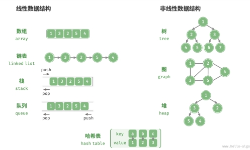

# 数据结构分类

常见的数据结构包括数组、链表、栈、队列、哈希表、树、堆、图，它们可以从“逻辑结构”和“物理结构”两个维度进行分类。

## 1. 逻辑结构：线性与非线性

- 线性数据结构：数组、链表、栈、队列、哈希表。
- 非线性数据结构：树、堆、图、哈希表。

## 2. 物理结构：连续和离散

在计算机中，内存和硬盘是两种主要的存储硬件设备。硬盘主要用于长期存储数据，容量较大（通常可达到TB 级别）、速度较慢。内存用于运行程序时暂存数据，速度较快，但容量较小（通常为 GB 级别）。

**在算法运行过程中，相关数据都存储在内存中。系统通过内存地址来访问目标位置的数据。**

**物理结构反映了数据在计算机内存中的存储方式**，可分为连续空间存储（数组）和离散空间存储（链表）。物理结构从底层决定了数据的访问、更新、增删等操作方法，同时在时间效率和空间效率方面呈现出互补的特点。

**所有数据结构都是基于数组、链表或二者的组合实现的。** 例如，栈和队列既可以使用数组实现，也可以使用链表实现；而哈希表的实现可能同时包含数组和链表。

- 基于数组可实现：栈、队列、哈希表、树、堆、图、矩阵、张量（维度 ≥ 3 的数组）等。
- 基于链表可实现：栈、队列、哈希表、树、堆、图等。

基于数组实现的数据结构也被称为“静态数据结构”，这意味着此类数据结构在初始化后长度不可变。相对应地，基于链表实现的数据结构被称为“动态数据结构”，这类数据结构在初始化后，仍可以在程序运行过程中对其长度进行调整。
