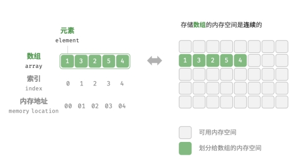
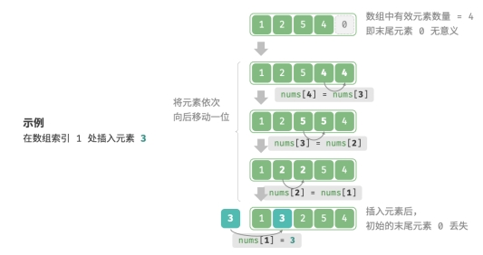

# 数组

「数组 array」是一种线性数据结构，其将相同类型元素存储在连续的内存空间中。



## 1. 初始化数组

```javascript
var arr = new Array(5).fill(0);
var nums = [1, 3, 2, 5, 4];
```

## 2. 访问数组

数组元素被存储在连续的内存空间中，这意味着计算数组元素的内存地址非常容易。在数组中访问元素是非常高效的，我们可以在 𝑂(1) 时间内随机访问数组中的任意一个元素。

```javascript
/* 随机访问元素 */
function randomAccess(nums) {
  // 在区间 [0, nums.length) 中随机抽取一个数字
  const random_index = Math.floor(Math.random() * nums.length);
  // 获取并返回随机元素
  const random_num = nums[random_index];
  return random_num;
}
```

## 3. 插入元素

数组元素在内存中是“紧挨着的”，它们之间没有空间再存放任何数据。如果想要在数组中间插入一个元素，则需要将该元素之后的所有元素都向后移动一位，之后再把元素赋值给该索引。



```javascript
/* 在数组的索引 index 处插入元素 num */
function insert(nums, num, index) {
  // 把索引 index 以及之后的所有元素向后移动一位
  for (let i = nums.length - 1; i > index; i--) {
    nums[i] = nums[i - 1];
  }
  // 将 num 赋给 index 处元素
  nums[index] = num;
}
```

## 4. 删除元素

若想要删除索引 𝑖 处的元素，则需要把索引 𝑖 之后的元素都向前移动一位。


```javascript
/* 删除索引 index 处元素 */
function remove(nums, index) {
  // 把索引 index 之后的所有元素向前移动一位
  for (let i = index; i < nums.length - 1; i++) {
    nums[i] = nums[i + 1];
  }
}
```

总的来看，数组的插入与删除操作有以下缺点：

- 时间复杂度高：数组的插入和删除的平均时间复杂度均为 𝑂(𝑛) ，其中 𝑛 为数组长度。
- 丢失元素：由于数组的长度不可变，因此在插入元素后，超出数组长度范围的元素会丢失。
- 内存浪费：我们可以初始化一个比较长的数组，只用前面一部分，这样在插入数据时，丢失的末尾元素都是“无意义”的，但这样做也会造成部分内存空间的浪费。

## 5. 数组的扩容

**JavaScript 的 Array 是动态数组，可以直接扩展。**

## 6. 数组的应用

数组是一种基础且常见的数据结构，既频繁应用在各类算法之中，也可用于实现各种复杂数据结构。

- 随机访问：如果我们想要随机抽取一些样本，那么可以用数组存储，并生成一个随机序列，根据索引实现样本的随机抽取。
- 排序和搜索：数组是排序和搜索算法最常用的数据结构。快速排序、归并排序、二分查找等都主要在数组上进行。
- 查找表：当我们需要快速查找一个元素或者需要查找一个元素的对应关系时，可以使用数组作为查找表。假如我们想要实现字符到 ASCII 码的映射，则可以将字符的 ASCII 码值作为索引，对应的元素存放在数组中的对应位置。
- 机器学习：神经网络中大量使用了向量、矩阵、张量之间的线性代数运算，这些数据都是以数组的形式构建的。数组是神经网络编程中最常使用的数据结构。
- 数据结构实现：数组可以用于实现栈、队列、哈希表、堆、图等数据结构。例如，图的邻接矩阵表示实际上是一个二维数组。
