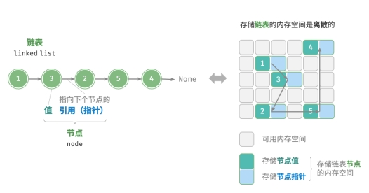
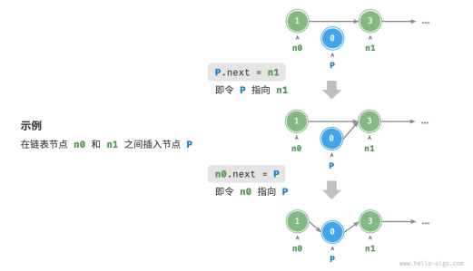
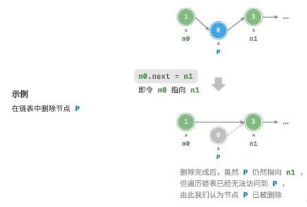
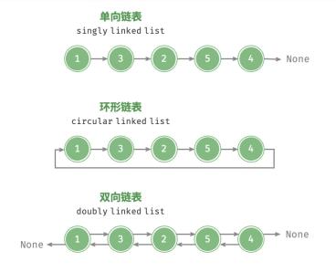

# 链表

内存空间是所有程序的公共资源，在一个复杂的系统运行环境下，空闲的内存空间可能散落在内存各处。存储数组的内存空间必须是连续的，而当数组非常大时，内存可能无法提供如此大的连续空间。此时链表的灵活性优势就体现出来了。

「链表 linked list」是一种线性数据结构，其中的每个元素都是一个节点对象，各个节点通过“引用”相连接。引用记录了下一个节点的内存地址，通过它可以从当前节点访问到下一个节点。

**链表的设计使得各个节点可以被分散存储在内存各处，它们的内存地址是无须连续的。**



链表的组成单位是「节点 node」对象。每个节点都包含两项数据：节点的“值”和指向下一节
点的“引用”。

- 链表的首个节点被称为“头节点”，最后一个节点被称为“尾节点”。
- 尾节点指向的是“空”，被记为 null。

## 1. 初始化链表

建立链表分为两步，第一步是初始化各个节点对象，第二步是构建引用指向关系。初始化完成后，我们就可以从链表的头节点出发，通过引用指向 `next` 依次访问所有节点。

```javascript
/* 初始化链表 1 -> 3 -> 2 -> 5 -> 4 */
// 初始化各个节点
const n0 = new ListNode(1);
const n1 = new ListNode(3);
const n2 = new ListNode(2);
const n3 = new ListNode(5);
const n4 = new ListNode(4);
// 构建引用指向
n0.next = n1;
n1.next = n2;
n2.next = n3;
n3.next = n4;
```

## 2. 插入节点

在链表中插入节点非常容易。假设我们想在相邻的两个节点 n0 和 n1 之间插入一个新节点 P，只需要改变两个节点引用（指针）即可，时间复杂度为 𝑂(1) 。



相比之下，在数组中插入元素的时间复杂度为 𝑂(𝑛) ，在大数据量下的效率较低。

```javascript
/* 在链表的节点 n0 之后插入节点 P */
function insert(n0, P) {
  const n1 = n0.next;
  P.next = n1;
  n0.next = P;
}
```

## 3. 删除节点

在链表中删除节点也非常方便，只需改变一个节点的引用（指针）即可。

**尽管在删除操作完成后节点 P 仍然指向 n1，但实际上遍历此链表已经无法访问到 P，这意味着 P 已经不再属于该链表了。**



```javascript
/* 删除链表的节点 n0 之后的首个节点 */
function remove(n0) {
  if (!n0.next) return;
  // n0 -> P -> n1
  const P = n0.next;
  const n1 = P.next;
  n0.next = n1;
}
```

## 4. 访问节点

在链表访问节点的效率较低。我们可以在 𝑂(1) 时间下访问数组中的任意元素。链表则不然，程序需要从头节点出发，逐个向后遍历，直至找到目标节点。也就是说，访问链表的第 𝑖 个节点需要循环 𝑖 − 1 轮，时间复杂度为 𝑂(𝑛) 。

```javascript
/* 访问链表中索引为 index 的节点 */
function access(head, index) {
  for (let i = 0; i < index; i++) {
    if (!head) {
      return null;
    }
    head = head.next;
  }
  return head;
}
```

## 5. 查找节点

遍历链表，查找链表内值为 target 的节点，输出节点在链表中的索引。此过程也属于线性查找。

```javascript
/* 在链表中查找值为 target 的首个节点 */
function find(head, target) {
  let index = 0;
  while (head !== null) {
    if (head.val === target) {
      return index;
    }
    head = head.next;
    index += 1;
  }
  return -1;
}
```

## 6. 链表和数组

数组和链表的各项特点与操作效率，由于它们采用两种相反的存储策略，因此各种性质和
操作效率也呈现对立的特点。

|            | 数组                     | 链表         |
| ---------- | ------------------------ | ------------ |
| 存储方式   | 连续内存空间             | 离散内存空间 |
| 缓存局部性 | 友好                     | 不友好       |
| 容量扩展   | 长度不可变               | 可灵活扩展   |
| 内存效率   | 占用内存少、浪费部分空间 | 占用内存多   |
| 访问元素   | 𝑂(1)                     | 𝑂(𝑛)         |
| 添加元素   | 𝑂(𝑛)                     | 𝑂(1)         |
| 删除元素   | 𝑂(𝑛)                     | 𝑂(1)         |

## 7. 常见链表类型

- 单向链表：即上述介绍的普通链表。单向链表的节点包含值和指向下一节点的引用两项数据。我们将首个节点称为头节点，将最后一个节点称为尾节点，尾节点指向空 None 。
- 环形链表：如果我们令单向链表的尾节点指向头节点（即首尾相接），则得到一个环形链表。在环形链表中，任意节点都可以视作头节点。
- 双向链表：与单向链表相比，双向链表记录了两个方向的引用。双向链表的节点定义同时包含指向后继节点（下一个节点）和前驱节点（上一个节点）的引用（指针）。相较于单向链表，双向链表更具灵活性，可以朝两个方向遍历链表，但相应地也需要占用更多的内存空间。



Q&A:

数组存储在栈上和存储在堆上，对时间效率和空间效率是否有影响？
栈内存分配由编译器自动完成，而堆内存由程序员在代码中分配（注意，这里的栈和堆和数据结构中的栈和堆不是同一概念）。

1. 栈不灵活，分配的内存大小不可更改；堆相对灵活，可以动态分配内存。
2. 栈是一块比较小的内存，容易出现内存不足；堆内存很大，但是由于是动态分配，容易碎片化，管理堆内存的难度更大、成本更高。
3. 访问栈比访问堆更快，因为栈内存较小、对缓存友好，堆帧分散在很大的空间内，会出现更多的缓存未命中。
