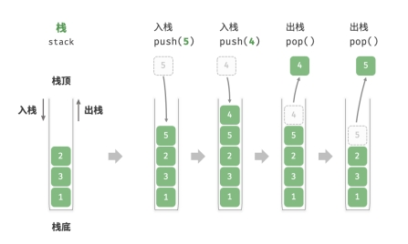

# 栈

「栈 stack」是一种遵循先入后出的逻辑的线性数据结构。

可以将栈类比为桌面上的一摞盘子，如果需要拿出底部的盘子，则需要先将上面的盘子依次取出。将盘子替换为各种类型的元素（如整数、字符、对象等），就得到了栈数据结构。

把堆叠元素的顶部称为“栈顶”，底部称为“栈底”。将把元素添加到栈顶的操作叫做“入栈”，删除栈顶元素的操作叫做“出栈”。



**Javascript 没有内置的栈类，可以把 Array 当作栈来使用。**

**此栈可以被视为一种受限制的数组或链表。** 可以“屏蔽”数组或链表的部分无
关操作，使其对外表现的逻辑符合栈的特性。

```javascript
/* 初始化栈 */
const stack = [];

/* 元素入栈 */
stack.push(1);
stack.push(3);
stack.push(2);
stack.push(5);
stack.push(4);

/* 访问栈顶元素 */
const peek = stack[stack.length-1];

/* 元素出栈 */
const pop = stack.pop();

/* 获取栈的长度 */
const size = stack.length;

/* 判断是否为空 */
const is_empty = stack.length === 0;
```

## 栈的应用

- 浏览器中的后退与前进、软件中的撤销与反撤销。每当我们打开新的网页，浏览器就会将上一个网页执行入栈，这样我们就可以通过后退操作回到上一页面。后退操作实际上是在执行出栈。如果要同时支持后退和前进，那么需要两个栈来配合实现。
- 程序内存管理。每次调用函数时，系统都会在栈顶添加一个栈帧，用于记录函数的上下文信息。在递归函数中，向下递推阶段会不断执行入栈操作，而向上回溯阶段则会执行出栈操作。