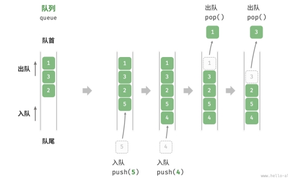
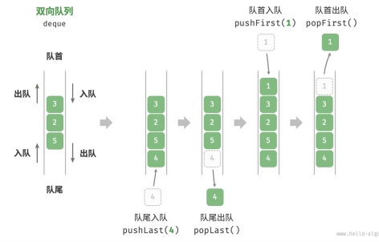

# 队列

「队列 queue」是一种遵循先入先出规则的线性数据结构。顾名思义，队列模拟了排队现象，即新来的人不断加入队列的尾部，而位于队列头部的人逐个离开。

将队列的头部称为“队首”，尾部称为“队尾”，将把元素加入队尾的操作称为“入队”，删除队首元素的操作称为“出队”。



```javascript
/* 初始化队列 */
const queue = [];

/* 元素入队 */
queue.push(1);
queue.push(3);
queue.push(2);
queue.push(5);
queue.push(4);

/* 访问队首元素 */
const peek = queue[0];

/* 元素出队 */
// 底层是数组，因此 shift() 方法的时间复杂度为 O(n)
const pop = queue.shift();

/* 获取队列的长度 */
const size = queue.length;

/* 判断队列是否为空 */
const empty = queue.length === 0;
```

## 1. 队列应用

- 淘宝订单。购物者下单后，订单将加入队列中，系统随后会根据顺序依次处理队列中的订单。在双十一期间，短时间内会产生海量订单，高并发成为工程师们需要重点攻克的问题。
- 各类待办事项。任何需要实现“先来后到”功能的场景，例如打印机的任务队列、餐厅的出餐队列等。队列在这些场景中可以有效地维护处理顺序。

## 2. 双向队列



```javascript
/* 初始化双向队列 */
const deque = [];

/* 元素入队 */
deque.push(2);
deque.push(5);
deque.push(4);

// 请注意，由于是数组，unshift() 方法的时间复杂度为 O(n)
deque.unshift(3);
deque.unshift(1);
console.log(" 双向队列 deque = ", deque); // 双向队列 deque = [1, 3, 2, 5, 4]

/* 访问元素 */
const peekFirst = deque[0];
console.log(" 队首元素 peekFirst = " + peekFirst); // 队首元素 peekFirst = 1
const peekLast = deque[deque.length - 1];
console.log(" 队尾元素 peekLast = " + peekLast); // 队尾元素 peekLast = 4

/* 元素出队 */
// 请注意，由于是数组，shift() 方法的时间复杂度为 O(n)
const popFront = deque.shift();
console.log(" 队首出队元素 popFront = " + popFront + "，队首出队后 deque = " + deque); // 队首出队元素 popFront = 1，队首出队后 deque = [3, 2, 5, 4]
const popBack = deque.pop();
console.log(" 队尾出队元素 popBack = " + popBack + "，队尾出队后 deque = " + deque); // 队尾出队元素 popBack = 4，队尾出队后 deque = [3, 2, 5]

/* 获取双向队列的长度 */
const size = deque.length;
console.log(" 双向队列长度 size = " + size); // 双向队列长度 size = 3

/* 判断双向队列是否为空 */
const isEmpty = size === 0;
console.log(" 双向队列是否为空 = " + isEmpty); // 双向队列是否为空 = false
```