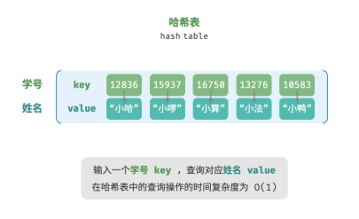

# 哈希表

「哈希表 hash table」，又称「散列表」，其通过建立键 key 与值 value 之间的映射，实现高效的元素查询。具体而言，我们向哈希表输入一个键 key ，则可以在 𝑂(1) 时间内获取对应的值 value 。

给定 𝑛 个学生，每个学生都有“姓名”和“学号”两项数据。假如我们希望实现“输入一个
学号，返回对应的姓名”的查询功能，则可以采用哈希表来实现：



## 1. 哈希表的常用操作

初始化、查询操作、添加键值对和删除键值对：

```javascript
/* 初始化哈希表 */
const map = new ArrayHashMap();

/* 添加操作 */
// 在哈希表中添加键值对 (key, value)
map.set(12836, "小哈");
map.set(15937, "小啰");
map.set(16750, "小算");
map.set(13276, "小法");
map.set(10583, "小鸭");

/* 查询操作 */
// 向哈希表输入键 key ，得到值 value
let name = map.get(15937);

/* 删除操作 */
// 在哈希表中删除键值对 (key, value)
map.delete(10583);
```

哈希表有三种常用遍历方式：遍历键值对、遍历键和遍历值：

```javascript
/* 遍历哈希表 */
console.info("\n遍历键值对 Key->Value");
for (const [k, v] of map.entries()) {
  console.info(k + " -> " + v);
}

console.info("\n单独遍历键 Key");
for (const k of map.keys()) {
  console.info(k);
}

console.info("\n单独遍历值 Value");
for (const v of map.values()) {
  console.info(v);
}
```

## 2. 常见哈希算法

|          | MD5                            | SHA‑1            | SHA‑2                        | SHA‑3                |
| -------- | ------------------------------ | ---------------- | ---------------------------- | -------------------- |
| 推出时间 | 1992                           | 1995             | 2002                         | 2008                 |
| 输出长度 | 128 bits                       | 160 bits         | 256 / 512 bits               | 224/256/384/512 bits |
| 哈希冲突 | 较多                           | 较多             | 很少                         | 很少                 |
| 安全等级 | 低，已被成功攻击               | 低，已被成功攻击 | 高                           | 高                   |
| 应用     | 已被弃用，仍用于数据完整性检查 | 已被弃用         | 加密货币交易验证、数字签名等 | 可用于替代 SHA‑2     |
