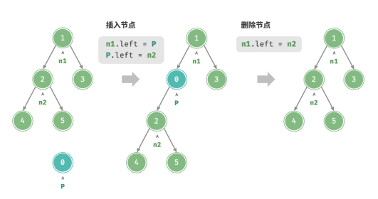
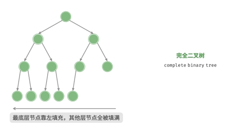
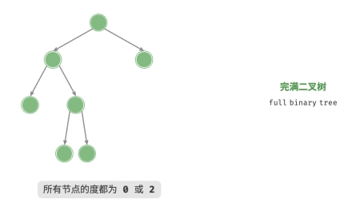
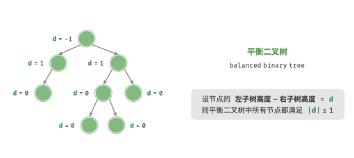
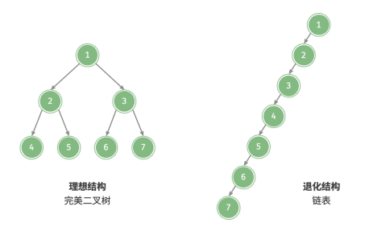

# 树

## 1. 二叉树

「二叉树 binary tree」是一种非线性数据结构，代表着祖先与后代之间的派生关系，体现着“一分为二”的
分治逻辑。与链表类似，二叉树的基本单元是节点，每个节点包含：值、左子节点引用、右子节点引用。

```javascript
/* 二叉树节点类 */
function TreeNode(val, left, right) {
  this.val = (val === undefined ? 0 : val); // 节点值
  this.left = (left === undefined ? null : left); // 左子节点引用
  this.right = (right === undefined ? null : right); // 右子节点引用
}
```

每个节点都有两个引用（指针），分别指向「左子节点 left‑child node」和「右子节点 right‑child node」，该节点被称为这两个子节点的「父节点 parent node」。当给定一个二叉树的节点时，我们将该节点的左子节点及其以下节点形成的树称为该节点的「左子树 left subtree」，同理可得「右子树 right subtree」。


## 1.1. 二叉树常见术语

- 「根节点 root node」：位于二叉树顶层的节点，没有父节点。
- 「叶节点 leaf node」：没有子节点的节点，其两个指针均指向 None 。
- 「边 edge」：连接两个节点的线段，即节点引用（指针）。
- 节点所在的「层 level」：从顶至底递增，根节点所在层为 1 。
- 节点的「度 degree」：节点的子节点的数量。在二叉树中，度的取值范围是 0、1、2 。
- 二叉树的「高度 height」：从根节点到最远叶节点所经过的边的数量。
- 节点的「深度 depth」：从根节点到该节点所经过的边的数量。
- 节点的「高度 height」：从最远叶节点到该节点所经过的边的数量。


## 1.2. 二叉树基本操作

与链表类似，首先初始化节点，然后构建引用（指针）。

### 1.2.1. 初始化二叉树

```javascript
/* 初始化二叉树 */
// 初始化节点
let n1 = new TreeNode(1),
n2 = new TreeNode(2),
n3 = new TreeNode(3),
n4 = new TreeNode(4),
n5 = new TreeNode(5);

// 构建引用指向（即指针）
n1.left = n2;
n1.right = n3;
n2.left = n4;
n2.right = n5;
```

### 1.2.2. 插入和删除节点

与链表类似，在二叉树中插入与删除节点可以通过修改指针来实现。



```javascript
/* 插入与删除节点 */
let P = new TreeNode(0);
// 在 n1 -> n2 中间插入节点 P
n1.left = P;
P.left = n2;

// 删除节点 P
n1.left = n2;
```

**插入节点可能会改变二叉树的原有逻辑结构，而删除节点通常意味着删除该节点及其所有子树。因此，在二叉树中，插入与删除操作通常是由一套操作配合完成的，以实现有实际意义的操作。**

## 1.3. 常见的二叉树类型

### 1.3.1. 完美二叉树

**完美二叉树常被称为「满二叉树」。**

「完美二叉树 perfect binary tree」除了最底层外，其余所有层的节点都被完全填满。在完美二叉树中，叶节点的度为 0 ，其余所有节点的度都为 2 ；若树高度为 ℎ ，则节点总数为 2^(ℎ+1) − 1 ，呈现标准的指数级关系，反映了自然界中常见的细胞分裂现象。


### 1.3.2. 完全二叉树

「完全二叉树 complete binary tree」只有最底层的节点未被填满，且最底层节点尽量靠左填充。




### 1.3.3. 完满二叉树

「完满二叉树 full binary tree」除了叶节点之外，其余所有节点都有两个子节点。



### 1.3.4. 平衡二叉树

「平衡二叉树 balanced binary tree」中任意节点的左子树和右子树的高度之差的绝对值不超过 1。



## 1.4. 二叉树的退化

当二叉树的每层节点都被填满时，达到“完美二叉树”；而当所有节点都偏向一侧时，二叉树退化为“链表”。

- 完美二叉树是理想情况，可以充分发挥二叉树“分治”的优势。
- 链表则是另一个极端，各项操作都变为线性操作，时间复杂度退化至 𝑂(𝑛) 。



在最佳和最差结构下，二叉树的叶节点数量、节点总数、高度等达到极大或极小值。
